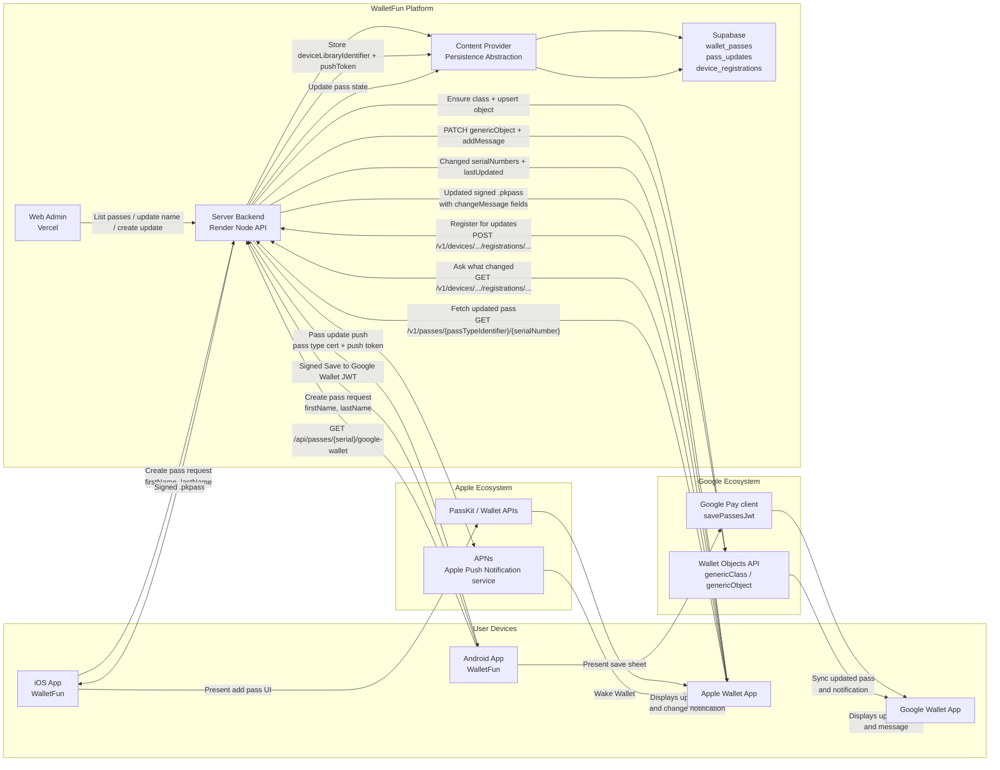

# WalletFun Pass Flow

```mermaid
flowchart LR
  subgraph User["User Devices"]
    IOS["iOS App\nWalletFun"]
    WALLET["Apple Wallet App"]
    ANDROID["Android App\nWalletFun"]
    GWALLET["Google Wallet App"]
  end

  subgraph Apple["Apple Ecosystem"]
    PASSKIT["PassKit / Wallet APIs"]
    APNS["APNs\nApple Push Notification service"]
  end

  subgraph Google["Google Ecosystem"]
    PAYCLIENT["Google Pay client\nsavePassesJwt"]
    WALLETOBJECTS["Wallet Objects API\ngenericClass / genericObject"]
  end

  subgraph WalletFun["WalletFun Platform"]
    WEB["Web Admin\nVercel"]
    API["Server Backend\nRender Node API"]
    PROVIDER["Content Provider\nPersistence Abstraction"]
    DB["Supabase\nwallet_passes\npass_updates\ndevice_registrations"]
  end

  IOS -->|"Create pass request\nfirstName, lastName"| API
  ANDROID -->|"Create pass request\nfirstName, lastName"| API
  API --> PROVIDER
  PROVIDER --> DB

  API -->|"Signed .pkpass"| IOS
  IOS -->|"Present add pass UI"| PASSKIT
  PASSKIT --> WALLET

  ANDROID -->|"GET /api/passes/{serial}/google-wallet"| API
  API -->|"Ensure class + upsert object"| WALLETOBJECTS
  API -->|"Signed Save to Google Wallet JWT"| ANDROID
  ANDROID -->|"Present save sheet"| PAYCLIENT
  PAYCLIENT --> GWALLET

  WALLET -->|"Register for updates\nPOST /v1/devices/.../registrations/..."| API
  API -->|"Store deviceLibraryIdentifier + pushToken"| PROVIDER

  WEB -->|"List passes / update name / create update"| API
  API -->|"Update pass state"| PROVIDER
  PROVIDER --> DB

  API -->|"Pass update push\npass type cert + push token"| APNS
  APNS -->|"Wake Wallet"| WALLET

  API -->|"PATCH genericObject + addMessage"| WALLETOBJECTS
  WALLETOBJECTS -->|"Sync updated pass\nand notification"| GWALLET

  WALLET -->|"Ask what changed\nGET /v1/devices/.../registrations/..."| API
  API -->|"Changed serialNumbers + lastUpdated"| WALLET

  WALLET -->|"Fetch updated pass\nGET /v1/passes/{passTypeIdentifier}/{serialNumber}"| API
  API -->|"Updated signed .pkpass\nwith changeMessage fields"| WALLET

  WALLET -->|"Displays updated pass\nand change notification"| User
  GWALLET -->|"Displays updated pass\nand message"| User
```
