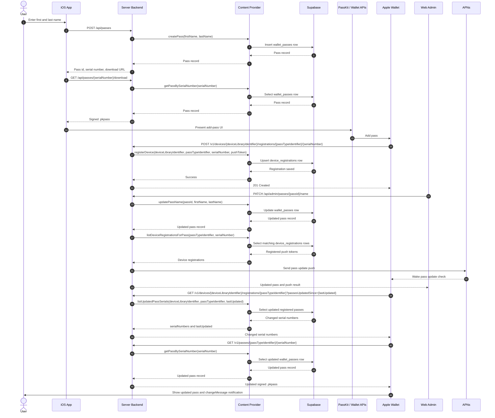

# WalletFun Pass Sequence

```mermaid
sequenceDiagram
  autonumber
  actor User
  participant IOS as iOS App
  participant API as Server Backend
  participant Provider as Content Provider
  participant DB as Supabase
  participant PassKit as PassKit / Wallet APIs
  participant Wallet as Apple Wallet
  participant Admin as Web Admin
  participant APNs as APNs

  User->>IOS: Enter first and last name
  IOS->>API: POST /api/passes
  API->>Provider: createPass(firstName, lastName)
  Provider->>DB: Insert wallet_passes row
  DB-->>Provider: Pass record
  Provider-->>API: Pass record
  API-->>IOS: Pass id, serial number, download URL

  IOS->>API: GET /api/passes/{serialNumber}/download
  API->>Provider: getPassBySerialNumber(serialNumber)
  Provider->>DB: Select wallet_passes row
  DB-->>Provider: Pass record
  Provider-->>API: Pass record
  API-->>IOS: Signed .pkpass

  IOS->>PassKit: Present add-pass UI
  PassKit->>Wallet: Add pass
  Wallet->>API: POST /v1/devices/{deviceLibraryIdentifier}/registrations/{passTypeIdentifier}/{serialNumber}
  API->>Provider: registerDevice(deviceLibraryIdentifier, passTypeIdentifier, serialNumber, pushToken)
  Provider->>DB: Upsert device_registrations row
  DB-->>Provider: Registration saved
  Provider-->>API: Success
  API-->>Wallet: 201 Created

  Admin->>API: PATCH /api/admin/passes/{passId}/name
  API->>Provider: updatePassName(passId, firstName, lastName)
  Provider->>DB: Update wallet_passes row
  DB-->>Provider: Updated pass record
  Provider-->>API: Updated pass record

  API->>Provider: listDeviceRegistrationsForPass(passTypeIdentifier, serialNumber)
  Provider->>DB: Select matching device_registrations rows
  DB-->>Provider: Registered push tokens
  Provider-->>API: Device registrations
  API->>APNs: Send pass update push
  APNs-->>Wallet: Wake pass update check
  API-->>Admin: Updated pass and push result

  Wallet->>API: GET /v1/devices/{deviceLibraryIdentifier}/registrations/{passTypeIdentifier}?passesUpdatedSince={lastUpdated}
  API->>Provider: listUpdatedPassSerials(deviceLibraryIdentifier, passTypeIdentifier, lastUpdated)
  Provider->>DB: Select updated registered passes
  DB-->>Provider: Changed serial numbers
  Provider-->>API: serialNumbers and lastUpdated
  API-->>Wallet: Changed serial numbers

  Wallet->>API: GET /v1/passes/{passTypeIdentifier}/{serialNumber}
  API->>Provider: getPassBySerialNumber(serialNumber)
  Provider->>DB: Select updated wallet_passes row
  DB-->>Provider: Updated pass record
  Provider-->>API: Updated pass record
  API-->>Wallet: Updated signed .pkpass
  Wallet->>User: Show updated pass and changeMessage notification
```
