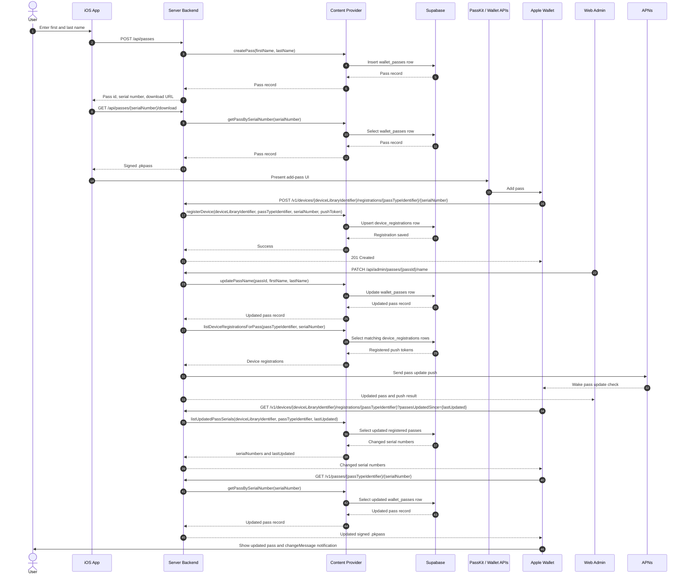
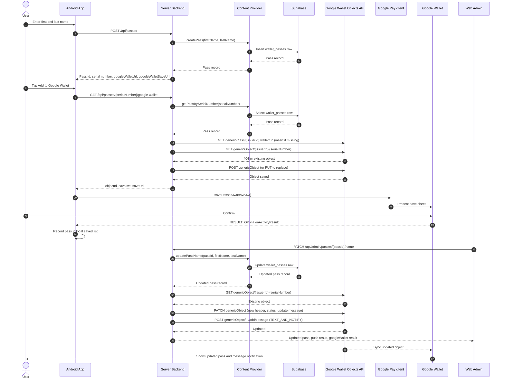

# WalletFun Pass Sequence

## Apple Wallet (iOS)

## Google Wallet (Android)

Google Wallet has no device registration or push token step. The server owns the pass as a Generic Object in the Wallet Objects API, and Google syncs object changes to every wallet holding it.

